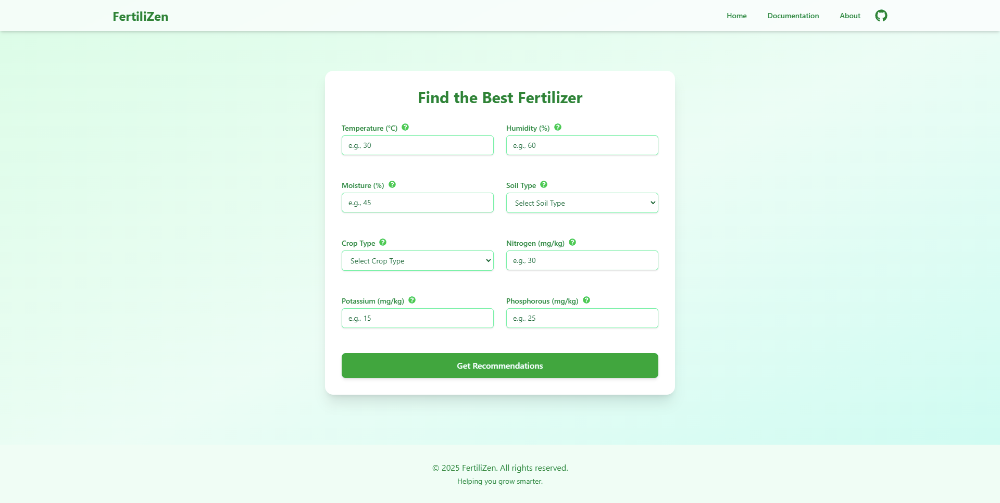

# FertiliZen — Fertilizer Recommendation Web App

FertiliZen is a web application that recommends optimal fertilizers based on soil and environmental parameters. This project was developed to enhance skills in both machine learning model deployment and full-stack web development (React frontend, Flask backend).

**Disclaimer:** This is a learning project. The model's predictions are based on a specific dataset and may not be accurate or suitable for real-world agricultural decisions. Always consult with agricultural experts for practical farming advice.



## Machine Learning Model & Prediction Strategy

The core of this application is a **stacking ensemble machine learning model** designed to predict the optimal fertilizer type based on various soil and environmental parameters. This approach leverages multiple advanced models and combines their strengths for robust and accurate predictions.

The prediction strategy involves the following key components:

1. **Base Models with K-Fold Cross-Validation**: Three powerful gradient boosting models are used as base learners:
    * **LightGBM**
    * **CatBoost**
    * **XGBoost**
   Each base model is trained using stratified k-fold cross-validation. For every fold, the model is trained on k-1 parts and validated on the remaining part, generating out-of-fold (OOF) predictions for the entire training set. This ensures robust generalization and prevents overfitting.

2. **Feature Engineering**: The input data undergoes extensive feature engineering, including:
    * Creating **nutrient ratios** (e.g., Nitrogen to Phosphorous ratio)
    * Applying **logarithmic and square transformations** to numerical features
    * Generating **interaction terms** (e.g., Temperature × Humidity)
    * Encoding categorical features (e.g., soil and crop type) using custom label encoders

3. **Stacking Ensemble (Meta-Model)**: The OOF predicted probabilities from all base models are concatenated to form a new feature set. A meta-model (Logistic Regression) is then trained on these stacked features to learn how to best combine the base models' outputs. This meta-model is responsible for making the final prediction.

4. **Prediction Pipeline**: For new data, the same preprocessing and feature engineering steps are applied. Each base model (with its k-fold ensemble) predicts class probabilities, which are averaged and stacked. The meta-model then uses these stacked probabilities to produce the final fertilizer recommendation, supporting top-N predictions with probability scores.

5. **Artifact Management**: All trained models, encoders, feature lists, and the stacking scaler are saved to disk for reproducible and consistent inference.

**Why This Approach?**
- Stacking with k-fold cross-validation makes the model more robust and less likely to overfit. The meta-model can learn which base model to trust more for different types of data, resulting in improved accuracy and reliability for fertilizer recommendations.

### Model File Versions

**Lightweight Version (Current):**
- The web application currently uses `xgboost_kfold_models.joblib` - a lightweight version of the XGBoost models
- This version is optimized for web deployment to ensure fast response times and minimal memory usage
- Suitable for real-time predictions in the web interface

**High-Accuracy Version (Available):**
- For maximum accuracy, `xgboost_kfold_models_original.joblib` is available (3.5GB)
- This larger model file was not loaded in the predictor due to potential memory issues and loading delays
- Can be used for offline analysis or when accuracy is prioritized over speed
- To use the original model, replace the lightweight file in the `trained_models_kfold/` directory

**Note:** The lightweight version maintains good accuracy while being much more suitable for web deployment. The original version provides marginally better performance but at the cost of significantly larger file size and slower loading times.

### Model Development Notebook

The detailed process of data exploration, preprocessing, feature engineering, individual model training, and ensemble creation is documented in the Jupyter Notebook: `notebook/enhanced-fertilizer-prediction-with-ensemble-model.ipynb`.

This notebook covers:
*   **Exploratory Data Analysis (EDA)**: Understanding data distributions, correlations, and relationships between features and the target fertilizer type.
*   **Data Preprocessing**: Cleaning data, encoding categorical variables, and preparing it for modeling.
*   **Feature Engineering**: Creating new informative features from the existing ones.
*   **Model Training**: Individually training XGBoost, LightGBM, and CatBoost classifiers.
*   **Artifact Management**: Saving trained models, label encoders, and feature lists.
*   **Reusable Prediction Class**: Development of a `FertilizerPredictor` class that encapsulates the entire prediction pipeline, including preprocessing, feature engineering, and ensemble prediction logic. This class is what the Flask backend uses to serve predictions.
*   **Evaluation**: Assessing model performance using metrics like accuracy and confusion matrices.

*   **Original Model Inspiration:** The initial concept for a simpler, single XGBoost model and the dataset are inspired by the Kaggle competition "[Playground Series S5E6 - Classification with an Academic Success Dataset](https://www.kaggle.com/competitions/playground-series-s5e6)" (though the competition task is different, the classification and deployment aspects are similar). The ensemble model represents a significant enhancement over this initial idea.
*   **My Previous Single Model Development:** An earlier version focusing only on XGBoost can be found here: [Predict Optimal Fertilizer - XGB](https://www.kaggle.com/code/himanmanduja/predict-optimal-fertilizer-xgb). The current ensemble model in this project is more advanced.

### Exploratory Data Analysis (EDA) Highlights

Visual insights from the EDA phase help understand the data's characteristics:

*(Selection of EDA images - more can be found in the `docs/EDA` directory)*

<details>
<summary>Click to view EDA Images</summary>

**Distribution of Target Variable (Fertilizer Name):**


**Histograms of Numerical Features:**


**Correlation Matrix:**


**Fertilizer Distribution by Crop Type:**


</details>

### Model Evaluation Highlights

The ensemble model's performance is evaluated, and confusion matrices help visualize its effectiveness in distinguishing between different fertilizer types. It's important to note that while direct accuracy for a single top prediction is a standard metric, the context of the original Kaggle competition (which inspired parts of this work) often involves submitting the top-3 predictions. Providing top-N predictions can significantly increase the practical utility and effective accuracy of the model in such scenarios, as the correct answer is more likely to be within the top few suggestions. Our `FertilizerPredictor` class supports generating these top-N predictions.

*(Selection of Model Evaluation images - more can be found in the `docs/Model Eval` directory)*

<details>
<summary>Click to view Model Evaluation Images</summary>

**Ensemble Model Confusion Matrix (on Custom Test Data K=1):**

.png)

**Individual Model Examples (XGBoost):**


**Individual Model Examples (CatBoost):**


**Individual Model Examples (LightGBM):**


</details>

## Technologies Used

<div align="center">

### Backend & Machine Learning


### Frontend & Development


</div>

## Folder Structure

```
.
├── app.py
├── explained.md
├── LICENSE
├── Predictor.py
├── README.md
├── requirements.txt
├── docs/
│   ├── EDA/
│   ├── images/
│   └── Model Eval/
├── fertilizer-predictor-web/
│   ├── public/
│   ├── src/
│   ├── index.html
│   ├── package.json
│   ├── package-lock.json
│   ├── vite.config.js
│   └── ...
├── notebook/
│   └── Kaggle Notebook and Outputs/
│       ├── fertilizer-predictor-eda.ipynb
│       ├── fertilizer-predictor-predictor.ipynb
│       ├── fertilizer-predictor-training.ipynb
│       ├── submission_stacked_ensemble.csv
│       ├── predictor output/
│       └── trainer output/
│           ├── catboost_info/
│           ├── model_diagnostics_kfold/
│           ├── trained_models_kfold/
│           ├── __results___files/
│           └── ...
├── trained_models_kfold/
│   ├── catboost_kfold_models.joblib
│   ├── dataframe_column_encoder.joblib
│   ├── feature_names.joblib
│   ├── lgbm_kfold_models.joblib
│   ├── meta_model_logistic_regression.joblib
│   ├── stacking_scaler.joblib
│   ├── target_label_encoder.joblib
│   └── xgboost_kfold_models.joblib
└── ...
```

## Further Documentation

For a beginner-friendly, in-depth explanation of the project's Jupyter notebooks and the overall ML workflow, see [FertiliZen Notebooks Explained](explained.md).

## Setup and Installation

### Prerequisites

*   Python 3.7+
*   Node.js and npm (or yarn)

### Backend (Flask)

1.  **Clone the repository:**
    ```bash
    git clone https://github.com/HimanM/Predicting-Optimal-Fertilizers.git
    cd Predicting Optimal Fertilizers
    ```
2.  **Create a virtual environment (recommended):**
    ```bash
    python -m venv venv
    source venv/bin/activate  # On Windows: venv\Scripts\activate
    ```
3.  **Install Python dependencies:**
    The project includes a `requirements.txt` file with all necessary Python packages. Install them using:
    ```bash
    pip install -r requirements.txt 
    ```

### Frontend (React + Vite)

1.  **Navigate to the frontend directory:**
    ```bash
    cd fertilizer-predictor-web
    ```
2.  **Install Node.js dependencies:**
    ```bash
    npm install
    ```
    *(This will also install `axios`, `@tailwindcss/aspect-ratio`, `react-router-dom`, `react-icons` as they are part of the project setup)*

## Running the Application

1.  **Start the Backend (Flask API):**
    Open a terminal, navigate to the project root directory (where `app.py` is located), and activate your virtual environment.
    ```bash
    flask run
    ```
    The Flask API will typically start on `http://127.0.0.1:5000`.

2.  **Start the Frontend (React App):**
    Open another terminal, navigate to the `fertilizer-predictor-web` directory.
    ```bash
    npm run dev
    ```
    The React development server will start, usually on `http://localhost:5173` (Vite's default) or another port if 5173 is busy. The application will open in your default web browser.

    The Vite dev server is configured to proxy API requests from `/api` to the Flask backend, so there's no need for manual CORS configuration during development.

---

This project is a demonstration of integrating a machine learning model into a web application. It serves as a portfolio piece showcasing skills in data science and web development.
